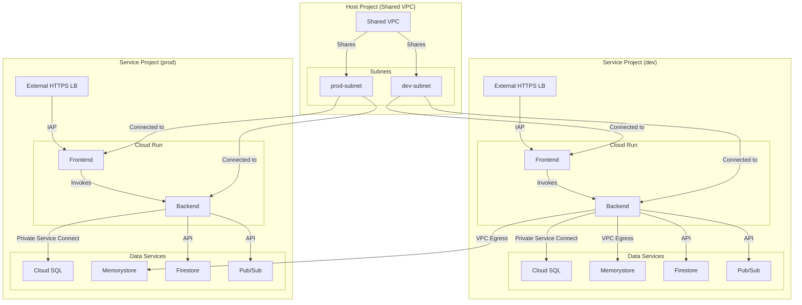

# IAC Monorepo for Serverless Applications

This repository provides a "golden path" for deploying secure and scalable serverless applications on Google Cloud Platform (GCP) using Terraform and Terragrunt. It establishes a production-ready foundation by implementing security and configuration best practices from the start.

## Architecture Overview

This monorepo is designed around a central **Shared VPC** architecture, which provides centralized network management and security. The core components of the architecture are:

- **Terragrunt:** Used for managing remote state and keeping the Terraform configuration DRY (Don't Repeat Yourself).
- **Terraform Modules:** Reusable modules for deploying various GCP services.
- **Shared VPC:** A centralized network in a host project, shared with service projects.
- **Direct VPC Egress:** For Cloud Run services to communicate with the VPC network without a Serverless VPC Access Connector.
- **Private Service Connect (PSC):** For secure and private connections from the VPC to Cloud SQL and Memorystore.

The following services are managed by this repository:

- Cloud Run
- Cloud SQL (PostgreSQL)
- Memorystore (Redis)
- Firestore
- Pub/Sub
- Secret Manager
- Cloud Load Balancing with IAP (Identity-Aware Proxy)

## Directory Structure

The repository is organized into two main directories:

- `live`: Contains the Terragrunt configuration for each environment (`dev`, `prod`). This is where you define the specific inputs for your applications.
- `modules`: Contains the reusable Terraform modules that define the infrastructure for the services.

## Configuration Strategy

This repository follows a clear strategy for managing default values to ensure a clean and maintainable codebase:

- **Organizational Standards in Root `env.hcl`:** The `env.hcl` file at the root of the repository is the single source of truth for organizational standards and conventions. This includes default values for:
    - `t_shirt_sizes`: The standard application sizes for your organization.
    - `sizing`: The default size for new applications (e.g., "small").
    - Default container images for new services.

- **Technical Defaults in Module `variables.tf`:** The `variables.tf` file within the module is used for technical defaults that are intrinsic to the module's behavior. These are values that are likely to be the same for most users of the module, regardless of the environment.

This separation of concerns makes it easy to manage organizational standards in a centralized location, while keeping the module's interface clean and focused on its technical inputs.

### DNS Configuration

The DNS configuration is also managed in the root `env.hcl` file, allowing for a centralized DNS strategy. The following variables can be set:

- `dns_project_id`: The project ID of the central DNS project.
- `public_dns_zone_name`: The name of the public managed DNS zone.
- `private_dns_zone_name`: The name of the private managed DNS zone.
- `base_domain`: The base domain for the applications.

This allows you to manage your DNS configuration in a single place and have the module automatically create the necessary `A` records for your applications.

## Prerequisites

Before you can use this repository, you need to perform the following manual steps in your GCP environment:

1.  **Set up a Shared VPC:** You need a host project with a Shared VPC and at least two service projects attached to it (one for `dev` and one for `prod`).
2.  **Create Subnets:** In your Shared VPC, create a subnet for each environment (e.g., `dev-us-central1`, `prod-us-central1`).
3.  **Enable Private Google Access:** For each of the subnets you create, you must enable **Private Google Access**. This allows resources within the subnet to reach Google APIs and services without needing an external IP address.
4.  **Grant IAM Permissions:** For each of your service projects, you need to grant the `compute.networkUser` role to the Cloud Run service agent. This allows the service agent to use the shared VPC network. You can do this with the following `gcloud` command:

    ```bash
    gcloud projects add-iam-policy-binding [HOST_PROJECT_ID] --member=serviceAccount:service-[SERVICE_PROJECT_NUMBER]@serverless-robot-prod.iam.gserviceaccount.com --role=roles/compute.networkUser
    ```

    Replace `[HOST_PROJECT_ID]` with the project ID of your Shared VPC host project, and `[SERVICE_PROJECT_NUMBER]` with the project number of your service project.

## Usage

1.  **Configure your environment:** In the `live` directory, each environment has an `env.hcl` file. Update these files with your project-specific information, such as `project_id` and `environment`.
2.  **Configure your application:** For each application you want to deploy, you will have a `terragrunt.hcl` file. You need to update the `inputs` block in this file with the details of your network and application.

    Here is an example for a `dev` environment application:

    ```hcl
    inputs = {
      name = basename(get_terragrunt_dir())

      network_project_id = "your-shared-vpc-host-project-id"
      vpc_name           = "your-shared-vpc-name"
      subnet_name        = "dev-us-central1"
    }
    ```

    **Note:** The container images are set to `us-docker.pkg.dev/cloudrun/container/hello` to allow for the creation of the infrastructure. This repository is for infrastructure only. The lifecycle of your application, including building and deploying container images, should be managed in a separate CI/CD pipeline.

3.  **Deploy your infrastructure:** Once you have configured your environment and application, you can deploy the infrastructure using Terragrunt:

    ```bash
    terragrunt run-all apply
    ```

## Cloud Governance and Labeling

To ensure proper cloud governance and resource tracking, this repository enforces a consistent labeling strategy for all created resources. The following labels are applied:

- `environment`: Identifies the deployment environment (e.g., `dev`, `prod`).
- `application`: The name of the application.
- `team`: The team responsible for the application.

These labels are configured in the following way:

- The `environment_label` is set in the `env.hcl` file for each environment.
- The `application_label` and `team_label` are set in the `terragrunt.hcl` file for each application.

This ensures that all resources are properly tagged and can be easily identified and managed.

### Load Balancer Configuration

By default, the frontend is deployed behind an external HTTPS load balancer. You can change this behavior using the `frontend_load_balancer_type` variable. Set it to `"INTERNAL"` to deploy the frontend behind an internal HTTPS load balancer.

All internal load balancers now use HTTPS for enhanced security. You must provide a domain for the internal load balancers using the `internal_load_balancer_domain` variable.

Here is an example of how to configure an internal frontend load balancer:

```hcl
inputs = {
  name = basename(get_terragrunt_dir())

  frontend_load_balancer_type = "INTERNAL"
  internal_load_balancer_domain = "your-internal-domain.com"
}
```

## Security

This repository is designed with security in mind. Some of the security best practices implemented include:

- **Private Networking:** All services are deployed within a private network, and communication between them is over the private network.
- **Least Privilege:** Dedicated service accounts are used for Cloud Run services, granting only the necessary permissions for their operations.
- **Cloud SQL IAM Authentication:** Cloud SQL is configured to use IAM database authentication, eliminating the need for managing database passwords and enhancing security. This also removes the need for Secret Manager to store database credentials.
- **Identity-Aware Proxy (IAP):** The load balancer is protected by IAP, which allows you to control access to your application based on user identity. IAP is applied directly to the load balancer's backend service, providing granular control over who can access the application. To enable IAP, you must provide a support email address via the `iap_support_email` variable, which is used to configure the OAuth brand.
- **Disabled Default URLs:** By default, the public URLs for Cloud Run services are disabled to prevent direct access and ensure that all traffic is routed through the load balancer. This behavior can be controlled with the `disable_default_url` variable.
- **VPC Egress Control:** The outbound traffic from the Cloud Run services can be controlled using the `frontend_vpc_egress` and `backend_vpc_egress` variables. This allows you to restrict traffic to within the VPC or allow all outbound traffic, depending on your needs.

### Service Accounts and IAM

Dedicated service accounts are created for the Cloud Run frontend and backend services, ensuring fine-grained control over resource access. These service accounts are conditionally created based on the enablement flags for the respective Cloud Run services.

- **Frontend Service Account:**
    - Created if `enable_cloud_run_frontend` is `true`.
    - Granted the `roles/run.invoker` role on the backend Cloud Run service, allowing the frontend to securely invoke the backend.

- **Backend Service Account:**
    - Created if `enable_cloud_run_backend` is `true`.
    - Granted specific roles to interact with other GCP services, with roles assigned only if the corresponding data service is enabled:
        - **Memorystore (Redis):** `roles/redis.editor` (if `enable_memorystore` is `true`)
        - **Pub/Sub:** `roles/pubsub.editor` (if `enable_pubsub_topics` is `true`)
        - **Firestore:** `roles/datastore.user` (if `enable_firestore` is `true`)
        - **Cloud SQL:** `roles/cloudsql.client` (if `enable_cloud_sql` is `true`)

This approach ensures that each service has only the permissions it needs, minimizing the blast radius in case of a security compromise.

### Deletion Protection

By default, the Cloud SQL database instance is protected from accidental deletion in all environments. To destroy the database, you must set the `force_destroy` variable to `true` in your `terragrunt.hcl` file and run `terragrunt run-all apply` before running `terragrunt run-all destroy`.

## Configuration Best Practices

This repository is designed to promote best practices for managing infrastructure as code. Here are some of the key principles and practices embedded in this monorepo:

- **Centralized Configuration:** The root `env.hcl` file serves as a single source of truth for organizational standards, such as t-shirt sizes for applications and default container images. This ensures consistency and makes it easy to manage global settings.

- **Hierarchical Configuration:** Terragrunt's hierarchical configuration model is used to keep the code DRY (Don't Repeat Yourself). Common configurations are defined in the root `terragrunt.hcl` and inherited by the child configurations in the `live` directory.

- **Environment-Specific Configuration:** Each environment (`dev`, `prod`) has its own `env.hcl` file, allowing you to override the default settings with environment-specific values. This provides flexibility while maintaining a consistent structure.

- **Module-Based Architecture:** The infrastructure is organized into reusable Terraform modules, which are stored in the `modules` directory. This promotes code reuse and makes it easy to manage complex infrastructure.

- **Separation of Concerns:** The `live` directory is responsible for composing the modules and providing the necessary inputs, while the `modules` directory is responsible for defining the infrastructure. This separation of concerns makes the codebase easier to understand and maintain.

- **Security by Default:** The repository is designed with security in mind. All services are deployed in a private network, and communication between them is over the private network. IAM database authentication is used for Cloud SQL, and IAP is used to protect the load balancer.

- **Consistent Labeling:** A consistent labeling strategy is enforced for all created resources, which is essential for cloud governance and resource tracking.

## Architecture Diagram

The following diagram illustrates the architecture of the serverless application stack deployed by this repository:



